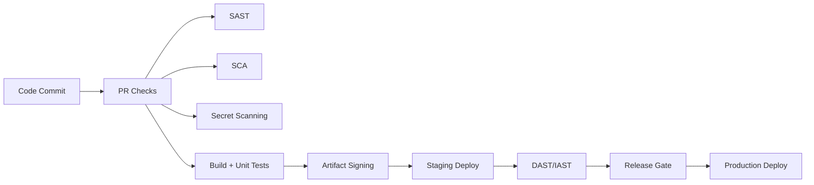
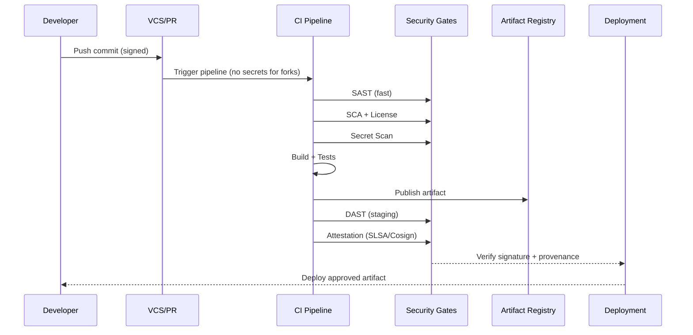

# DevSecOps Pipeline Security Checklist

Secure the delivery pipeline itself, not just application code. This checklist is designed for interview prep and real-world audits.

## Critical 5 (10-Minute Cram)

- **Signed artifacts**: Enforce `cosign` signatures and verify at deploy time.
- **OIDC only**: Use `OIDC` federation; eliminate long-lived cloud keys.
- **Untrusted PR safety**: No secrets on forked PRs; minimal `permissions`.
- **SLSA provenance**: Require attestations before release.
- **Immutable artifacts**: Pin by digest, not `latest`.

## Red Flags

- **Unpinned actions** or third-party steps with write tokens
- **Shared runners** without isolation or cleanup
- **Public registries** used as primary dependency sources
- **Admission control** not verifying signatures/provenance
- **Broad IAM** on CI/CD identities

## CI/CD Pipeline Security Checklist

### Pipeline Integrity

- **Build agent hardening**: Use minimal images, patch regularly, and disable unnecessary services.
- **Ephemeral runners**: Prefer short-lived, clean runners to reduce persistence risk.
- **Signed commits**: Enforce `GPG`/`SSH` commit signing on protected branches.
- **Protected branches**: Require reviews and status checks before merge.
- **Trusted actions**: Pin third-party actions by commit SHA and review sources.
- **Workflow permissions**: Set explicit `permissions` and avoid `write-all`.
- **Forked PR controls**: Avoid secrets on `pull_request` from forks; use `pull_request_target` safely.
- **OIDC claims**: Restrict `sub`/`aud` claims and use workload identity conditions.
- **Build cache safety**: Separate caches per repo/branch to prevent poisoning.
- **Reproducible builds**: Aim for deterministic builds to detect tampering.

### Secret Masking and Auth

- **Secret masking**: Mask secrets in logs and avoid `echo` of env vars.
- **OIDC federation**: Use `OIDC` for cloud auth (e.g., GitHub Actions -> AWS) instead of long-lived keys.
- **Scoped tokens**: Use short-lived, least-privilege tokens per workflow.
- **Secrets scanning**: Block commits that contain secrets and rotate on detection.

### Dependency Scanning (SCA)

- **Transitive CVEs**: Scan both direct and transitive dependencies.
- **License compliance**: Detect incompatible licenses before release.
- **Lockfiles**: Enforce `package-lock.json`, `poetry.lock`, `go.sum`, etc.
- **Update cadence**: Auto-update dependencies with gated reviews.

### Artifact Security

- **Image signing**: Sign container images with `cosign`.
- **Checksum verification**: Verify checksums for build artifacts and dependencies.
- **Private registry hardening**: Restrict pushes, enforce MFA, and disable anonymous pulls.
- **Immutable tags**: Use digests or immutable tags instead of `latest`.
- **Deploy-time verification**: Verify `cosign` signatures and `SLSA` attestations before deploy.
- **Admission control**: Enforce policy checks in cluster admission controllers.

## Automated Security Testing Gates

### SAST / DAST / IAST

- **Commit-time SAST**: Run fast SAST at `PR` time for high-signal rules.
- **Nightly deep scans**: Run full SAST/DAST/IAST on a schedule to reduce CI latency.
- **Break-the-build**: Fail on critical severity or exploitable findings with confirmed paths.
- **Triage workflow**: Require justification and expiration for suppressions.

### IaC Scanning

- **Pre-merge checks**: Scan `Terraform`/`CloudFormation` for public exposure and weak IAM.
- **Policy-as-code**: Enforce rules with `OPA`/`Conftest` or `Checkov`.
- **Drift detection**: Compare runtime config with IaC to detect unauthorized changes.

## Infrastructure and Supply Chain Checklist

### SBOM

- **Generation**: Create SBOMs (e.g., `CycloneDX`, `SPDX`) at build time.
- **Storage**: Store SBOMs with build artifacts and link to releases.
- **Traceability**: Map SBOM entries to deployed versions.

### Supply Chain

- **Dependency confusion**: Use private registries and namespace controls.
- **Typosquatting**: Allowlist package names and vendors.
- **Provenance**: Use `SLSA` provenance and signed attestations.
- **Registry proxying**: Route `npm`/`PyPI`/`Maven` through vetted mirrors.
- **Digest pinning**: Pin dependencies by hash where possible.

### Access Control

- **Least privilege**: Scope CI/CD service principals to specific repos and environments.
- **Environment separation**: Separate credentials for dev/staging/prod.
- **Break-glass**: Use short-lived elevated access with audit trails.

## Secure DevSecOps Pipeline Diagram

## Secure CI/CD Workflow (Sequence Diagram)

## References and Tools

### Secrets and Credential Hygiene

- **TruffleHog**: https://github.com/trufflesecurity/trufflehog
- **Gitleaks**: https://github.com/gitleaks/gitleaks
- **GitHub Secret Scanning**: https://docs.github.com/en/code-security/secret-scanning

### SCA and Container Scanning

- **Snyk**: https://snyk.io/
- **Trivy**: https://github.com/aquasecurity/trivy
- **OWASP Dependency-Check**: https://owasp.org/www-project-dependency-check/

### IaC Scanning and Policy

- **Checkov**: https://github.com/bridgecrewio/checkov
- **tfsec**: https://github.com/aquasecurity/tfsec
- **OPA/Conftest**: https://www.openpolicyagent.org/

### Artifact Signing and Provenance

- **Cosign**: https://github.com/sigstore/cosign
- **Sigstore**: https://www.sigstore.dev/
- **SLSA**: https://slsa.dev/
